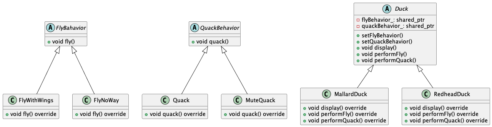
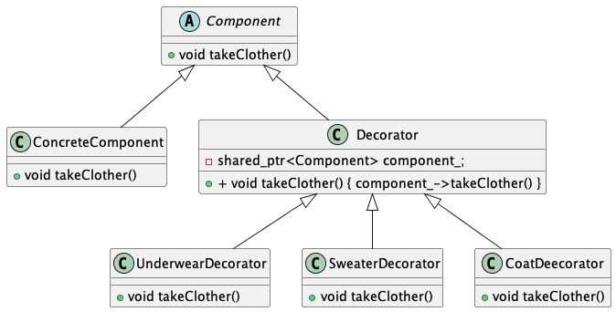
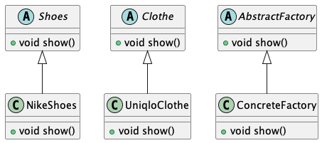

# Design Mode

## 目录

1. [策略模式](01-Strategy_Model)
2. [观察者模式](02-Observer_Model)
3. [装饰模式](03-Decorator_Model)
4. [抽象工厂模式](04-Factory_Model)

---

### 1. 策略模式

- **描述**：策略模式允许算法独立于使用它的客户端。
- **优点**：易于扩展和维护。
- **缺点**：增加了对象的数量。

### 2. 观察者模式

- **描述**：观察者模式定义了一种一对多的依赖关系，让多个观察者对象同时监听某一个主题对象。
- **优点**：降低耦合度。
- **缺点**：如果观察者过多，可能会导致性能问题。

### 3. 装饰模式

- **描述**：装饰器模式允许向一个现有的对象添加新的功能，同时又不改变其结构。
- **优点**：灵活性高，易于扩展。
- **缺点**：可能会导致类层次过于复杂。

### 4. 抽象工厂模式

- **描述**：工厂模式提供了一种创建对象的最佳方式。
- **优点**：封装了对象的创建过程。
- **缺点**：增加代码的复杂性。